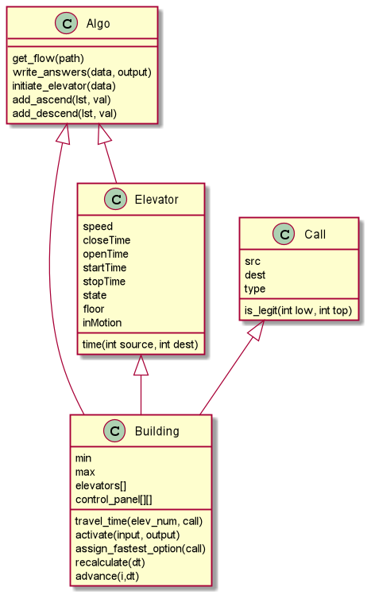

# Ex1_OOP
Second assignment on ObjectOrientedPrograming with python

## Plan
simple algorithm that keeps a time parameter
and would traverse the input file row by row and in each iteration it would:
+ advance the time parameter by the time passed until the next Call
+ recalculate the states of all elevators
+ Assign the new Call in a clever way

similar to an online algorithm but to take advantage of all the data at once is
actually harder, so we built some kind of simulation using 3 classes - Call, Elevator and Building, which is within Algo.

### Elevator
represents an elevator, holding the time parameters 
(speed, closing time, starting time etc.) 
and calculates the overall time of an elevator.

Each elevator would be in either of 3 states:
+ rest coded by 0
+ going up coded by 1      only picking up travelers that goes in its direction
+ going down coded by -1    same

An elevator at rest would change its state according to its first new Call

We would use a list

State "1" elevators would get new calls in ascended order and a
state "-1" elevators would get new calls in descended order

can be tested by making comparisons of given parameters and check the time
### Call
Represents an elevator call, holds the parameters source, destination and its type (up/down). 
also checks legitimacy of a call within given range (max and min floors of a building)

Can be tested by making comparisons of given parameters
and checking legitimacy within range and out of range

### Algo
The algorithm class which holds several functions and 
the building class to provide the optimal solutions.

##### functions
+ get_flow - reads the csv input.
+ write_answers - writes the csv output, with 
the allocation for each call
+ initiate elevator - builds an elevator object 
according to given data (json file)
+ add ascend/descend - each adds a call to a list 
in ascending / descending order

##### Building class
+ init - creates a list of elevators from given data and a control panel of pending calls for each elevator
+ travel time - calculates the overall travel time of an elevator with given call
+ activate - reads the given calls file and for each call assigns an elevator and in the end writes the output 
+ assign fastest option - the assigning function, uses the travel time to find the optimal elevator of a given call and appends accordingly the call to control panel
+ recalculate - calculates the passage of time
+ advance - updates the elevator locations

## UML

## simulation results
| Building (B1-B5) | Call Case | Avg Waiting Time  | Incomplete calls | Certificate |
|----------------|-----------|--------------------|------------------|-------------|
| B1             | a         | 112.92             | 0                | -277439261  |
| B2             | a         | 56.92              | 0                | -201460581  |
| B3             | a         | 38.2               | 0                | -5671071    |
| B3             | b         | 819.9195988        | 226              | -2923304115 |
| B3             | c         | 825.3115278        | 255              | -2951530831 |
| B3             | d         | 778.1467173        | 244              | -2787601910 |
| B4             | a         | 17.78              | 0                | -83564944   |
| B4             | b         | 487.1005658        | 120              | -1670615861 |
| B4             | c         | 490.9477989        | 62               | -1666862735 |
| B4             | d         | 450.0287982        | 107              | -1530471582 |
| B5             | a         | 11.44              | 0                | -96956958   |
| B5             | b         | 75.968             | 0                | -150263134  |
| B5             | c         | 74.25              | 0                | -146769715  |
| B5             | d         | 60.94              | 0                | -199052601  |
